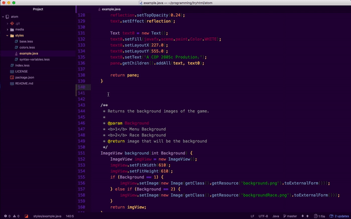

> TryHTML theme for [Atom](https://atom.io). Let's code in Indigo.

# Installation

Using  **Atom**  :

>Themes can be installed and changed from the **`Settings View`** which you can open by selecting

1. `Atom > Preferences` menu, and clicking the 
1. `Install` tab and select the 
1. `Themes` button on the left hand navigation. 
# Social

>
>
>

# Donate

# Contributors

 | 
--- |
[Carlos Abraham](https://github.com/19cah) |

# License

The **tryHTML** syntax theme for [Atom](https://atom.io) is licensed under [MIT license](LICENSE).
